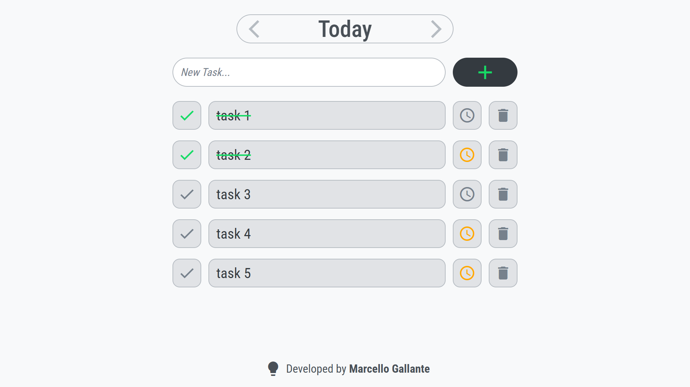

<h1 align="center">Recurring Task Board</h1>

<div align="center">

[]()


[](./LICENSE)

</div>

<div align="center">



</div>

## Table of Contents

- [Description](#description)
- [Features](#features)
- [Tech stack](#tech-stack)
- [Getting started](#getting-started)
- [Contributing](#contributing)
- [Support](#support)
- [Authors](#authors)
- [License](#license)

## Description

Single-page React app for recurring tasks grouped by **Today**, **Week**, **Month**, and **Year**. Each horizon acts as its own board: you add items for the current period, mark them done, optionally **fix** tasks so they survive calendar rollovers, and rely on **localStorage** so lists and theme survive reloads. It targets anyone who wants a lightweight, offline-first checklist that resets with the calendar unless a task is pinned.

## Features

- Flip between **Today**, **Week**, **Month**, and **Year** so you can plan at the horizon that matches how you think about work.
- Add tasks to whichever board you are viewing, and delete anything you no longer need.
- Mark tasks complete when you finish them, or unmark them if you need to revisit the work.
- Pin tasks you want to keep across calendar changes; when a new day, week, month, or year starts, pinned items stay on the list but show as not done again, while unpinned tasks for that horizon are removed.
- See buttons and headings in **English** or **Portuguese** based on your browser language (other languages fall back to English).
- Switch between **light** and **dark** screen styles to match your preference or lighting.

## Tech stack

**Frontend**

- React 17, `react-dom`, Create React App (`react-scripts` 5)
- `styled-components`, `@mui/material` (`createTheme` for palette), Google Fonts (Roboto Condensed) and Material Icons (loaded from Google)
- `i18next`, `react-i18next`

**Tooling / infrastructure**

- npm (`package-lock.json`)
- `gh-pages` for static deploy to GitHub Pages
- ESLint config extending `react-app` / Jest (CRA defaults)
- TypeScript listed as a dev dependency (CRA override); application source is JavaScript/JSX

## Getting started

#### Installation

```bash
npm install
```

#### Running the project

```bash
npm start
```

Serves the development build (default CRA: [http://localhost:3000](http://localhost:3000)).

## Contributing

1. Fork the repository and create a branch for your change.
2. Install dependencies and verify the app with `npm start` / `npm run build` as appropriate.
3. Open a pull request describing the change.

## Support

- Open an issue on [GitHub Issues](https://github.com/MllGll/recurring-task-board/issues) for bugs or feature requests.
- Marcello Gallante — [marcellogallante@gmail.com](mailto:marcellogallante@gmail.com)

## Authors

- **Marcello Gallante** — [GitHub](https://github.com/MllGll)

## License

This project is licensed under the [MIT License](./LICENSE).
